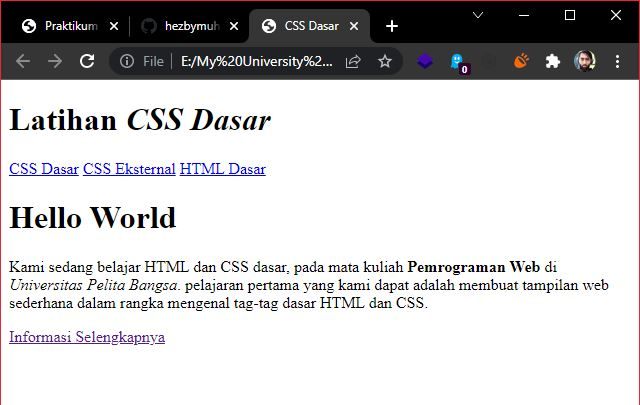
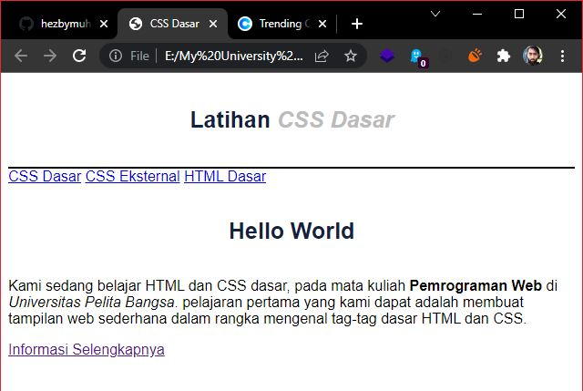
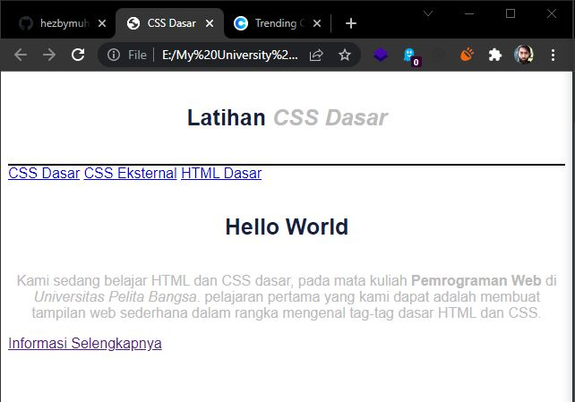
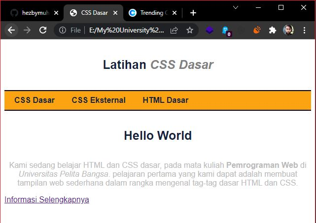
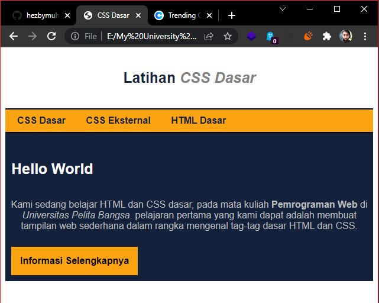
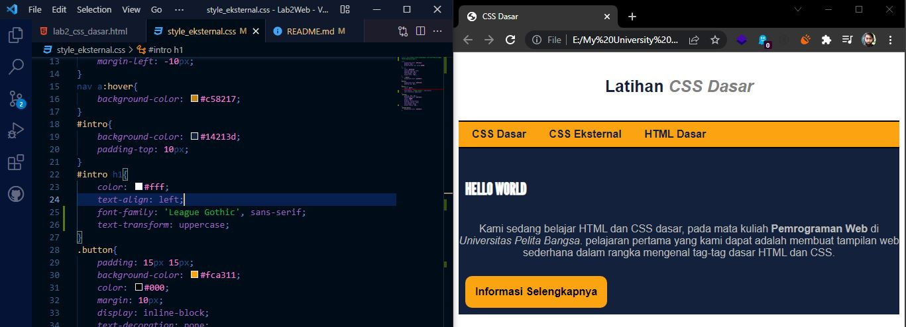
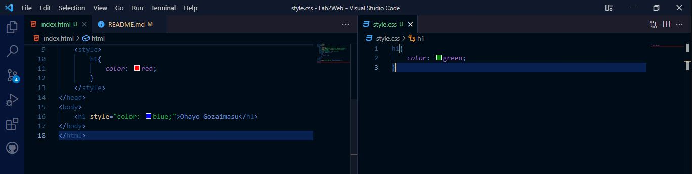
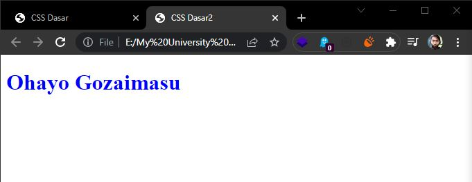
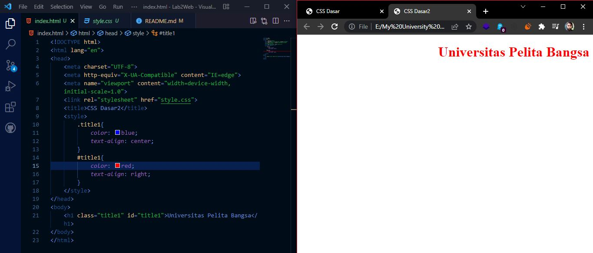

# **Tugas Praktikum (pert. 3)**

### 1. Membuat dokumen HTML
```html
<!DOCTYPE html>
<html lang="en">
<head>
    <meta charset="UTF-8">
    <meta http-equiv="X-UA-Compatible" content="IE=edge">
    <meta name="viewport" content="width=device-width, initial-scale=1.0">
    <title>CSS Dasar</title>
    <link rel="stylesheet" href="style.css">
</head>
<body>
    <div class="container">
        <header>
            <h1>Latihan <i>CSS Dasar</i></h1>
        </header>
        <nav>
            <a href="#">CSS Dasar</a>
            <a href="#">CSS Eksternal</a>
            <a href="#">HTML Dasar</a>
        </nav>
        <!-- CSS ID Selector -->
        <div id="intro">
            <h1>Hello World</h1>
            <p>
                Kami sedang belajar HTML dan CSS dasar, pada mata kuliah <b>Pemrograman Web</b> di <i>Universitas Pelita Bangsa</i>. pelajaran pertama yang kami dapat adalah membuat tampilan web sederhana dalam rangka mengenal tag-tag dasar HTML dan CSS.
            </p>
            <!-- CSS class selector -->
            <a href="" class="button btn-primary">Informasi Selengkapnya</a>
        </div>
    </div>
</body>
</html>
```


### 2. Mendeklarasikan CSS Internal
```css
    <title>CSS Dasar</title>
    <style>
        body{
            font-family: sans-serif;
        }
        header{
            min-height: 80px;
            border-bottom: 2px solid #000;
        }
        h1{
            font-size: 25px;
            color: #14213d;
            text-align: center;
            padding: 20px 10px;
        }
        h1 i{
            color: #808080;
        }
    </style>
</head>
```


### 3. Menambahkan Inline CSS
```html
<p style="text-align: center; color: #bbb;">
```


### 4. Membuat CSS Eksternal
```css
nav{
    background-color: #fca311;
    padding: 10px;
    border-bottom: 2px solid #000;
}
nav a{
    color: #14213d;
    text-decoration: none;
    padding: 10px 20px;
    font-weight: bold;
    margin-left: -10px;
}
nav a:hover{
    background-color: #c58217;
}
```


### 5. Menambahkan CSS Selector
```css
/* id Selector */
#intro{
    background-color: #14213d;
    padding-top: 10px;
}
#intro h1{
    color: #fff;
    text-align: left;
}
/* class selector */
.button{
    padding: 15px 15px;
    background-color: #fca311;
    color: #000;
    margin: 10px;
    display: inline-block;
    text-decoration: none;
    font-weight: bold;
}
.button:hover{
    background-color: #c58217;
}
```


# **Jawaban dari Pertanyaan dan Tugas**
1. Di sini, saya melakukan perubahan pada bagian **button** di CSS dengan menambahkan property ``{border-radius: 10px;}`` dan teks judul **Hello World** dengan merubah *font-family* -nya menjadi ``font-family: 'League Gothic', sans-serif;`` dengan font ``@import url('https://fonts.googleapis.com/css2?family=League+Gothic&display=swap');`` dari **Google Fonts** dan memaksa semua hurufnya menjadi kapital dengan ``text-transform: uppercase;``.



2. pendeklarasian CSS ``#intro h1{..}`` adalah dengan menggunakan selector ``id``, sedangkan ``h1{..}`` tidak menggunakan selector.

3. Ketika kita mendeklarasikan secara bersamaan antara ***INTERNAL, EKSTERNAL*** dan ***INLINE***, yang akan ditampilkan pada Browser adalah ***INLINE***. Karena ***INLINE*** Memiliki deklarasi prioritas dibanding ***EKSTERNAL*** atau pun ***INTERNAL***, seperti contoh yang saya buat, saya membuat dokumen baru HTML kemudian saya buat Elemen ``{h1}`` yang kemudian saya akan deklarasikan di CSS ***INTERNAL, EKSTERNAL*** dan juga ***INLINE*** Dengan property ``{color}`` yang berbeda, jika ***INTERNAL*** ``{color: red}``, sementara ***EKSTERNAL*** ``{color:green;}`` dan ***INLINE*** ``{color: blue;}``. Maka yang terpanggil di browser adalah ***INLINE*** karena memiliki prioritas.



**Hasil Deklarasinya**


4. Maka yang ditampilkan pertama adalah **ID**, karena **ID** adalah hitungan poin selector yang lebih besar daripada **Class**.

